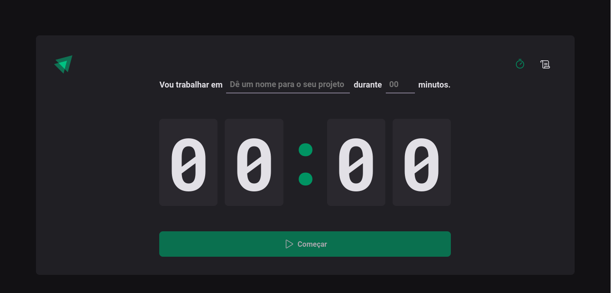
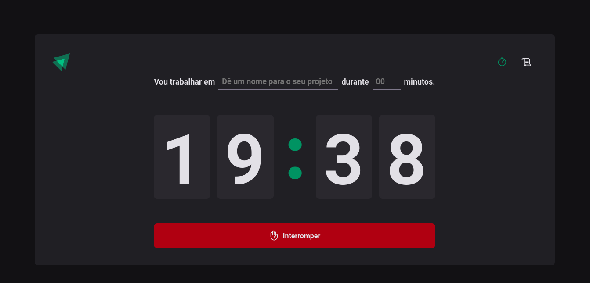

# SPA-IgniteTimer
Aplicação SPA completa

## Bibliotecas e Ferramentas utilizadas

  - Styled Components
  - React-Hook-Form com zod Resolver
  - immer
  - React-router-dom
  - EsLint
  - vite
  - ContextAPI
  - useReducer
  - date-fns
  

## Páginas
  
  ### Home
  - Com o Contador zerado
    

  - Rodando 20 minutos no contador
    

  ### History
  - Com o contado de 20 minutos rodando
  

  - Após interromper o contador
  